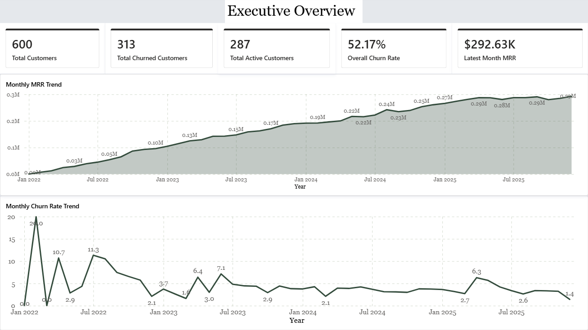
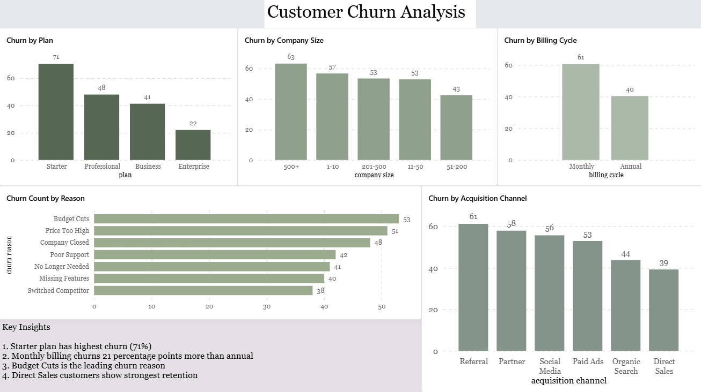
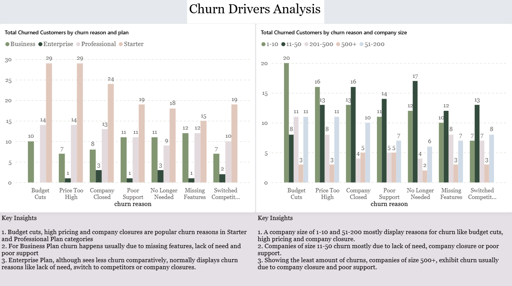
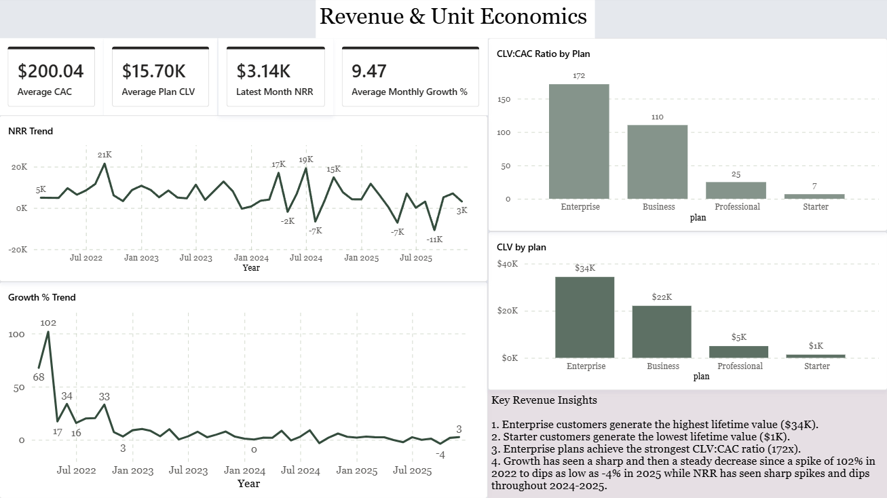
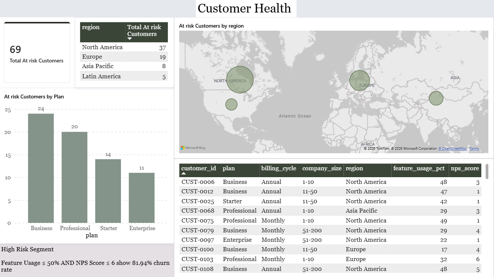

# SaaS Revenue & Churn Analysis

This project analyzes subscription-level customer data and monthly revenue data to identify churn drivers, detect at-risk customers, evaluate revenue trends, and assess SaaS unit economics.


## About
CloudTask Pro is a SaaS company that has grown from 0 to 600 customers since 2022. While revenue has been growing, the board has raised concerns about a high churn rate. 
The analysis is to understand the monthly churn trends, which customer segments are most at risk, and what the company’s unit economics look like (MRR per customer, customer acquisition cost vs. lifetime value).
## Tools Used
1. CSV files - source and analysis produced dataset
2. MySQL - Data cleaning and exploratory analysis
3. SQL - Business analysis queries
4. PowerBI - Dashboards
5. Github - Project Version Control

## Skills Demonstrated
### SQL
- Data Cleaning
- CTEs
- Window Functions
- Aggregate Functions
- View Creation

### Analytics
- Churn Analysis
- Customer Segmentation
- Customer Lifetime Value (CLV)
- Customer Acquisition Cost (CAC)
- Net Revenue Retention (NRR)
- Trend Analysis
- KPI Development

### Power BI
- Dashboard Design
- DAX Measures
- Data Modeling
- Interactive Visualizations

### Business Analysis
- Customer Retention Strategy
- Unit Economics Analysis
- Executive Reporting
- Risk Segmentation
## Datasets
### 1. subscriptions.csv
subscription-level dataset (600 rows):
- customer_id
- plan
- billing_cycle
- industry
- company_size
- seats
- monthly_revenue
- acquisition_channel
- region
- signup_date
- churned
- churn_date
- churn_reason
- support_tickets_12mo
- nps_Score
- feature_usage_pct
- upgraded
### 2. monthly_revenue.csv
monthly revenue summary (48 rows):
- month
- total_active_customers
- new_customers
- churned_customers
- monthly_churn_rate_pct
- total_mrr
- avg_revenue_per_customer
- customer_acquisition_cost

## Project Structure
```text
saas-revenue-churn-analysis/
│
├── data/
│   ├── raw/
│   └── cleaned/
│
├── sql/
│   ├── data_cleaning.sql
│   ├── final_schema.sql
│   ├── analysis/
│   │   ├── churn_analysis.sql
│   │   ├── revenue_analysis.sql
│   │   ├── unit_economics.sql
│   │   └── at_risk_analysis.sql
│   └── views.sql
│
├── powerbi/
│   └── SaaS_Churn_Dashboard.pbix
│
├── images/
│   └── dashboard screenshots
│
└── README.md
```
## Dashboard Preview

### Executive Overview


### Customer Churn Analysis


### Churn Drivers Analysis


### Revenue & Unit Economics


### Customer Health

## Workflow
### Data Import
- Imported and explored raw datasets
- Checked for duplicates, wrong datatypes, handling blanks and summary statistics
### Churn Analysis
- Calculated overall churn rate
- Analyzed churn rate and highest risk segments by plan, billing cycle, company size and acquisition channel
- Discovered popular reasons for churn
### Revenue Analysis
- Analyzed monthly MRR over time
- Calculated a simplified Net Revenue Retention using: \
NRR = New MRR - Churned MRR
- Computed month on month growth percent to identify unusual spikes and dips
### Unit Economics
- Computed average customer lifespan and average MRR by plan
- Calculated average CLV by plan and avg CAC
- Determined CLV:CAC ratio per plan
### At Risk Analysis
- Analyzed relationship between NPS score and churn
- Discovered risk threshold for NPS score through classifying churn rate in NPS score buckets
- Analyzed relationship between feature usage percentage and churn
- Discovered risk threshold for feature usage percentage through classifying churn rate in feature usage percentage buckets
- Computed number and percentage of at-risk customers based on risk thresholds of NPS score and feature usage percentage
### Power BI Data Models (SQL Views)
- Plan Churn Table
- Billing Cycle Churn Table
- Company Size Churn Table
- Acquisition Channel Churn Table
- Revenue Trends Table
- Plan CLV:CAC Table
- At Risk Customers Table
- Churn Reason Table
### Power BI Dashboard Pages (Visualization)
1. Executive Overview - Customer status, latest MRR, monthly MRR and churn rate trend
2. Customer Churn Analysis - Churn rate graphs by plan, billing cycle, company size and acquisition channels, churn reason graph
3. Churn drivers Analysis - Churn reason graph by plan and company size
4. Revenue & Unit Economics - KPI cards for average monthly, growth %, average plan CLV and average CAC and latest month NRR, graphs for CLV by plan and CLV:CAC ratio by plan, growth % trend and NRR trend
5. Customer Health - Total at risk customers KPI card, at risk customers table, regional distribution of at risk customers and by plan

## Key Insights
1. Overall churn rate = **52.17%**; churn rate has remained stable after a sharp spike in 2022 while demonstrating sudden small spikes and dips at times
2. Starter plan has the highest churn rate **(71%)** with monthly billing cycle negatively impacting retention **(61%)**
3. Budget cuts, high pricing and company closures are the top 3 reasons for customer churn.
    - The above reasons hold true for companies of size 1-10 and 51-200 as well as Starter and Professional plan categories
    - Other plans like Business and Enterprise and companies of size 11-50 and 500+ lean towards churn reasons like lack of product need, missing features or poor support
    - Enterprise plans and companies of size 500+ show the least amount of churn
4. Enterprise plans have the highest CLV **(34k)** followed by Business, Professional and Starter which has significantly less CLV **(1k)**
    - Average CAC = **200.04**
    - Most profitable plans according to CLV:CAC ratio is Enterprise followed by Business
5. Unusual NRR volatility was observed between 2024 and 2025, with major dips reaching **-11K** and spikes reaching **+19K**.
6. Significant customer churn indicators were discovered while evaluating the relationship between NPS score & churn rate and between feature usage percentage & churn rate. 
    - Customers with:
        - NPS score <= 6
        - feature usage percentage <= 50%
    - exhibit churn rate of **81.94%**
    - Neither metric alone demonstrated a similarly strong relationship, indicating that customer satisfaction and product adoption jointly provide a stronger churn signal than either metric independently.
7. According to the evaluated thresholds there are **69** customers at risk of churn in the dataset more than 50% of whom are based in North America
    - most of the at risk customers are on Business and Professional plans
## Retention Strategy
1. Boost healthier acquisition channels like direct sales and organic search
    - Direct sales and organic search channel gained customers reflect retention due to need for product and reachable support
    - Given that poor support and lack of need have been primary churn reasons for many customers, feedback based innovation, market research for customer requirements while fixing AI agents or 24x7 customer support and training for the same is required.
    - Social media acquisition channel brings in the least amount of customers (52 with a churn of 29) which points to the need for a better social media team or the requirement of one if not already present
    - Referral and Partner acquisition channels exhibit higher churn; however, this may be influenced by the distribution of customers across plans rather than the acquisition channels alone

2. Monthly billing cycle is performing badly as compared to annual billing cycle. Apart from Enterprise it performs bad in all the plans and thus a migration towards annual cycle is recommended 
    - The migration should preferably be through freebies, trial periods as gifts or discounted prices as high pricing and budget cuts have been primary churn reasons for most of the customers
3. Customers with NPS score <= 6 along with feature usage percentage <= 50 need to be put on high risk priority due to the 81.94% of churn rate in this segment
    - Customer surveys, new feature usage tutorial and dedicated problem solving common spaces online combined with fast issue resolving is advised
4. Starter plan performing poorly regardless of company size, acquisition channels, billing cycle etc
    - It demonstrates how churn reasons like budget cuts and high pricing impede migration to better plans while missing features and poor support reduce CLV altogether
    - Making other plans more affordable and soft launching more features in Starter plan through capping their usage is recommended
5. Regionally North America has the highest at risk customers (37) while in plan Business plan (24) holds the top rank.
    - Since missing features, poor support and lack of product need were the top churn reasons in Business plan, retention strategy should be specialized for this as well as based on the customer feedback of this segment

## Recommendations
1. Customer feedback and surveys
2. Feedback based innovation and feature augmentation
3. Customer support improvement through training and AI agents
4. Encourage migration towards annual billing cycle
5. New feature usage tutorial and issue resolving common spaces online and support
6. Support transition towards Business, Professional and Enterprise plans
7. Monitor and specialize retention strategy based on highest at risk customer segment
8. Onboarding and activation campaigns for product adoption
## Business Impact
The analysis identified:

- A high-risk customer segment exhibiting an 81.94% churn rate.
- Significant retention differences across plan tiers and billing cycles.
- Enterprise customers as the highest-value customer segment.
- Actionable retention opportunities through annual billing migration, support improvements, and product adoption initiatives
- These findings provide a framework for targeted retention initiatives, improved customer acquisition efficiency, and long-term revenue growth.
## Acknowledgements
This project was developed as part of my learning in data analysis. The datasets and problem context are based on guided case study resources, while all analysis and implementation are my own.
## License
This project is licensed under the MIT License.
